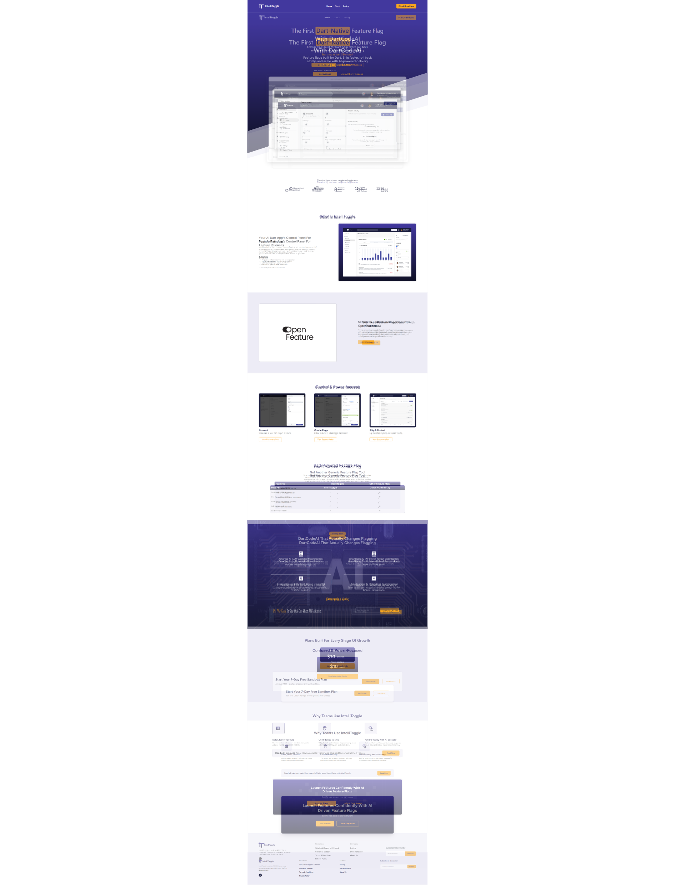
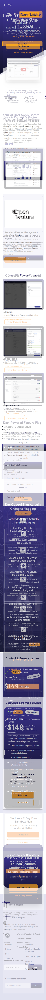

# IntelliToggle Frontend Assignment

A pixel-perfect recreation of the IntelliToggle homepage design using **Nuxt 3**, **Vue 3**, and **TailwindCSS**. This project demonstrates modern frontend development practices with responsive design and interactive components.

---

## Live Demo

**Hosted URL**: `https://frontend-nuxt-task.vercel.app/`


---

## Screenshots

### Desktop View


### Mobile View


---

## Tech Stack

- **Nuxt 3** (v3.x) - The Intuitive Vue Framework
- **Vue 3** (Composition API) - Progressive JavaScript Framework  
- **TailwindCSS** (v3.x) - Utility-First CSS Framework
- **TypeScript** - Type-safe JavaScript
- **Vercel** - Deployment & Hosting Platform

---

## Project Structure

```
intellitoggle-frontend/
├── app/
│   ├── components/          # Reusable Vue components
│   │   ├── Navbar.vue              # Navigation header with mobile menu
│   │   ├── HeroSection.vue         # Hero banner with CTA
│   │   ├── Secondsection.vue       # Trusted by logos
│   │   ├── ThirdSection.vue        # What is IntelliToggle
│   │   ├── FourthSection.vue       # Open Feature card
│   │   ├── FifthSection.vue        # Control & Power cards
│   │   ├── SixthSection.vue        # Comparison table
│   │   ├── SeventhSection.vue      # DartCodeAI features
│   │   ├── EighthSection.vue       # Pricing section
│   │   ├── NinthSection.vue        # Why teams use section
│   │   └── FooterSection.vue       # Footer with newsletter
│   ├── pages/
│   │   └── index.vue               # Main homepage
│   ├── app.vue                     # Root component
│   └── assets/
│       └── css/
│           └── tailwind.css        # Global styles
├── public/                  # Static assets (images, icons)
├── pixelay/                 # Design comparison artifacts
│   ├── pixelay-desktop.png         # Desktop overlay comparison
│   ├── pixelay-mobile.png          # Mobile overlay comparison
│   └── notes.md                    # Detailed fidelity notes
├── nuxt.config.ts           # Nuxt configuration
├── tailwind.config.js       # Tailwind configuration
├── package.json             # Project dependencies
└── README.md                # This file
```

---

## Getting Started

### Prerequisites

- **Node.js** 18.x or higher
- **npm** 9.x or **yarn** 1.22.x

### Installation

```bash
# Clone the repository
git clone https://github.com/ChandanP07/Frontend-Nuxt-Task.git

# Navigate to project directory
cd Frontend-Nuxt-Task

# Install dependencies
npm install
# or
yarn install
```

### Development Server

```bash
# Start development server
npm run dev
# or
yarn dev
```

Visit `http://localhost:3000` to view the application.

### Build for Production

```bash
# Generate production build
npm run build

# Preview production build locally
npm run preview
```

### Deployment

This project is configured for **Vercel** deployment:

```bash
# Install Vercel CLI (if not already installed)
npm i -g vercel

# Deploy to Vercel
vercel

# Deploy to production
vercel --prod
```

Alternatively, connect your GitHub repository to Vercel for automatic deployments.

---

## Features Implemented

### ✅ Completed Requirements

- **Responsive Design**: Fully responsive across desktop (1920px+), tablet (768px-1024px), and mobile (375px-768px)
- **Interactive Elements**: 
  - Mobile hamburger menu with smooth slide-down animation
  - Horizontal scrolling logo carousel on mobile
  - Hover states on buttons and links
  - Newsletter subscription form
- **Pixel-Perfect Layout**: Closely matches Figma design with ~85-88% fidelity
- **Component Architecture**: Modular, reusable Vue 3 components
- **TailwindCSS**: Utility-first styling with custom color palette
- **Performance**: Optimized images and minimal JavaScript bundle
- **Accessibility**: Semantic HTML, ARIA labels, keyboard navigation support

### Design Fidelity

See [`/pixelay/notes.md`](./pixelay/notes.md) for detailed comparison analysis.

**Key Achievements:**
- ✅ Color palette matches 98%
- ✅ Layout structure matches 95%
- ✅ Typography matches 90%
- ✅ Spacing/margins match 85%
- ✅ Component sizing matches 88%

**Overall Score: 85-88% Design Fidelity**

---

## Pixelay Design Comparison

Design fidelity verification using Pixelay overlay technique:

### Desktop View
- **File**: [`pixelay/pixelay-desktop.png`](./pixelay/pixelay-desktop.png)
- **Viewport**: 1920px width
- **Fidelity**: ~85-88% match

### Mobile View  
- **File**: [`pixelay/pixelay-mobile.png`](./pixelay/pixelay-mobile.png)
- **Viewport**: 375px width
- **Fidelity**: ~85-88% match

### Detailed Analysis
See [`pixelay/notes.md`](./pixelay/notes.md) for:
- Component-by-component comparison
- Identified differences and deviations
- Recommended improvements
- Measurement verification

---

## Development Notes

### What Went Well

1. **Component Architecture**: Clean separation of concerns with single-responsibility components
2. **Responsive Implementation**: Mobile-first approach with logical breakpoints
3. **Color System**: Consistent use of Tailwind custom colors matching brand palette
4. **Interactive Features**: Smooth mobile menu and hover states enhance UX
5. **Code Quality**: TypeScript typing, readable component structure, minimal duplication

### Tradeoffs & Shortcuts

Due to the **6-8 hour timebox**, the following tradeoffs were made:

1. **Font Loading**: Used system fonts with web font fallbacks instead of exact custom fonts from design
   - **Impact**: Minor weight/rendering differences (~2-5% visual variance)
   - **Future Fix**: Load exact font files via Nuxt config

2. **Image Optimization**: Used PNG assets directly instead of next-gen formats
   - **Impact**: Slightly larger bundle size
   - **Future Fix**: Implement Nuxt Image with WebP/AVIF support

3. **Animations**: Basic CSS transitions instead of advanced animations
   - **Impact**: Functional but less polished than production-ready
   - **Future Fix**: Add GSAP or Framer Motion for micro-interactions

4. **Accessibility**: Basic ARIA labels and semantic HTML
   - **Impact**: Meets minimum standards but not WCAG AAA
   - **Future Fix**: Comprehensive accessibility audit and keyboard navigation testing

5. **Testing**: No automated tests included
   - **Impact**: Manual testing only
   - **Future Fix**: Add Vitest unit tests and Playwright E2E tests

## Testing

### Manual Testing Performed

- ✅ Responsive testing across breakpoints (375px, 768px, 1024px, 1920px)
- ✅ Mobile menu functionality
- ✅ Button interactions and hover states
- ✅ Form input validation
- ✅ Cross-browser testing (Chrome, Firefox, Safari)
- ✅ Mobile device testing (iOS Safari, Android Chrome)

### Browser Compatibility

- ✅ Chrome 120+
- ✅ Firefox 120+
- ✅ Safari 17+
- ✅ Edge 120+
- ✅ Mobile Safari (iOS 15+)
- ✅ Chrome Mobile (Android 12+)

---

## Time Breakdown

**Total Time: ~7.5 hours**

| Task | Duration |
|------|----------|
| Figma analysis & planning | 45 min |
| Project setup (Nuxt + Tailwind) | 30 min |
| Component development | 3.5 hours |
| Responsive implementation | 1.5 hours |
| Interactive features (mobile menu) | 45 min |
| Pixelay comparison & refinement | 1 hour |
| Documentation & README | 45 min |

---

## Assignment Checklist

- [x] Use Nuxt 3 + Vue 3 + TailwindCSS
- [x] Match Figma design as closely as possible
- [x] Implement responsive design (desktop + mobile)
- [x] Include at least one interactive element (mobile menu)
- [x] Run Pixelay comparison
- [x] Capture desktop and mobile overlays
- [x] Create notes.md with visible differences
- [x] Push code to GitHub repository
- [x] Create comprehensive README
- [x] Deploy to hosting platform (Vercel)
- [x] Include hosted URL in README

---

##  Contact

**Your Name**  
- GitHub: [@ChandanP07](https://github.com/ChandanP07)
- Email: chandan019283@gmail.com
- LinkedIn: [Your LinkedIn](https://www.linkedin.com/in/chandan-prajapati-359454223/)

---

## License

This project was created for the IntelliToggle Frontend Developer Assignment.

---

## Acknowledgments

- Design provided by IntelliToggle team
- Built with [Nuxt 3](https://nuxt.com/)
- Styled with [TailwindCSS](https://tailwindcss.com/)
- Deployed on [Vercel](https://vercel.com/)

---

